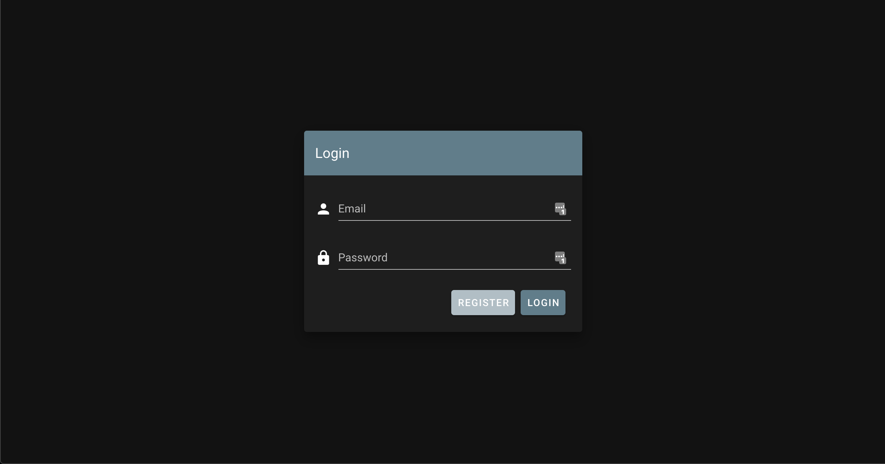
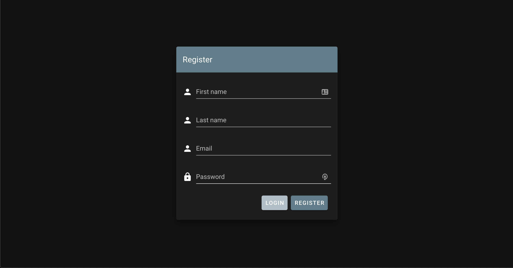
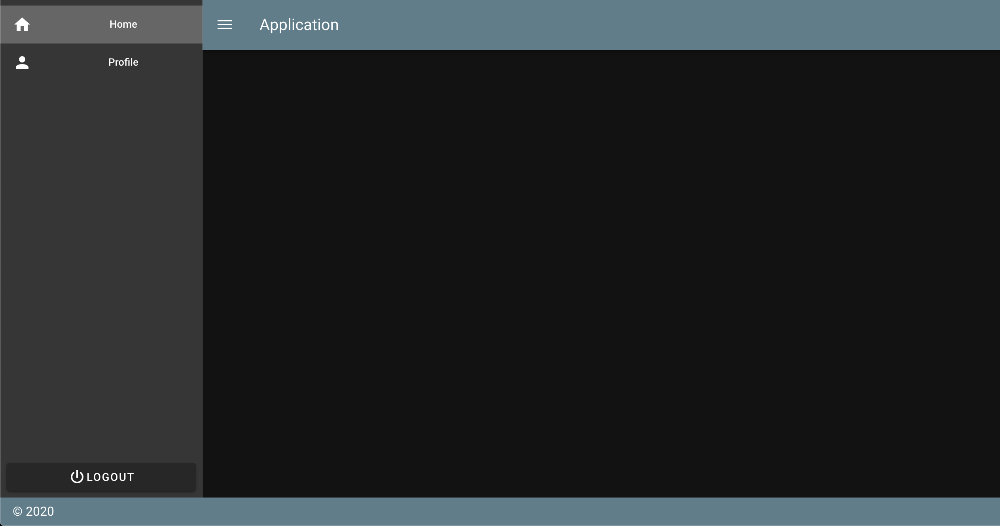
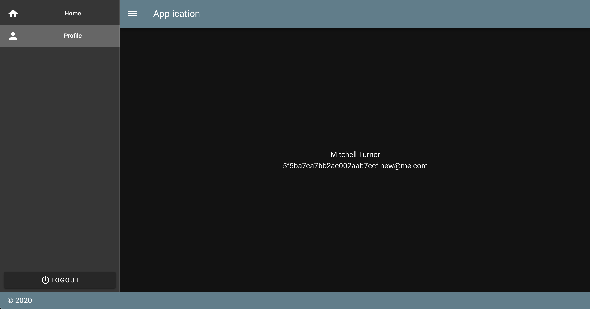

# Demo app for vuetify

# Running

```bash
docker-compose up -d
docker-compose logs -f client node-api
```

## Backend

The backend is built in node(express) and uses mongo as a datastore

## Auth
Authentication is handled with JWTs

## Frontend

The frontend is built with vue & vuetify

## Screenshots

### Login



### Register



### Main



### Profile




